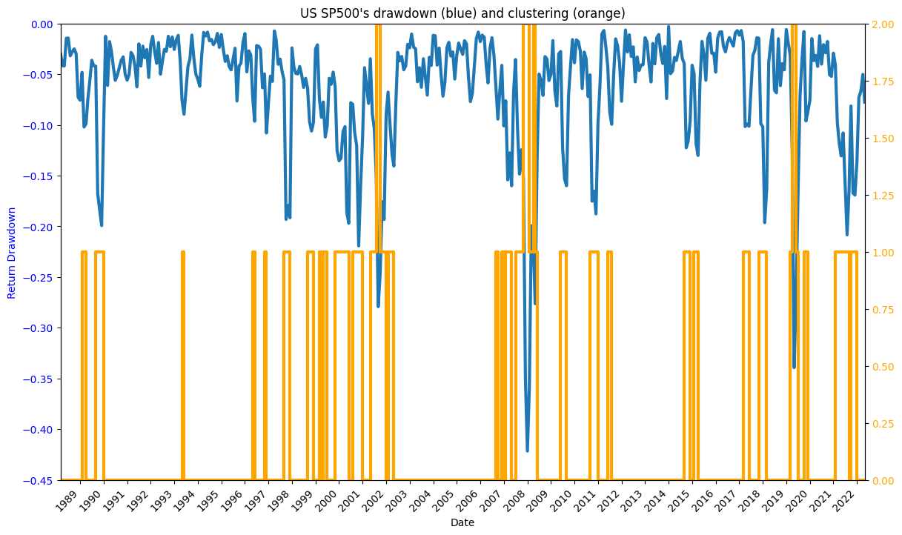
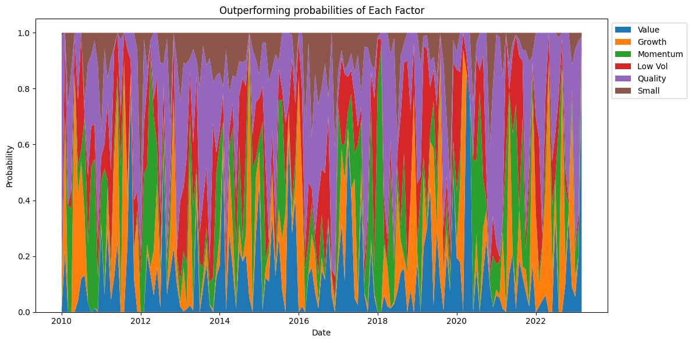
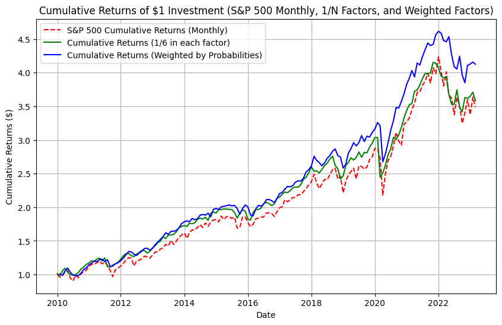
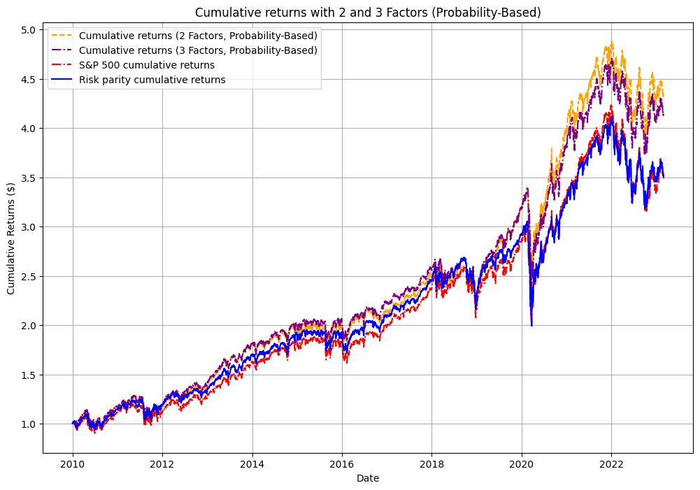

**English** | [Italiano](README.it.md)

# **Equity Factor Timing**: machine-learning-driven dynamic allocation across S&P 500 equity factors

[](https://github.com/orbitalfinance/equity-factor-timing/actions/workflows/ci.yml)

A system that identifies the market's **risk regime** and, based on it, picks **which equity factor** (value, growth, momentum, low-volatility, quality, small-cap) to overweight, building a monthly-rebalanced portfolio benchmarked against classic alternatives.

## What it is for

- **Factor timing**: work out which equity style tends to win in each market phase, instead of betting on a single static factor.
- **Market regime detection**: tell *normal* phases from *correction* phases using drawdowns and macroeconomic variables.
- **Strategy backtesting**: compare a *factor-timing* portfolio against S&P 500 buy-and-hold, equally-weighted and risk-parity, using standardised performance metrics.
- **Research / teaching base**: an end-to-end pipeline (data → clustering → classification → allocation → backtest) that is reusable and inspectable in a single notebook.

## Core idea (read this first)

The project rests on a **two-stage ML architecture**. *First stage*: an **unsupervised clustering** model (K-means over the S&P 500's monthly 3-month drawdowns) labels each month as a *normal* or *correction* regime; a **supervised classifier** (Random Forest / Naive Bayes / SVC combined into a **stacking** model tuned with **HyperOpt**) then learns to predict that regime from **macroeconomic** variables and Kritzman-Li **financial turbulence**. *Second stage*: for each regime, a **dedicated Random Forest** estimates the probability that each factor will be next month's *winner*. Those probabilities become the **weights** of a monthly-rebalanced portfolio, whose equity curve is measured with annual return, volatility, **Sharpe**, **max drawdown** and **Calmar**, and compared against the benchmarks. In short: *first work out which world you are in, then pick the right style for that world.*

## Results at a glance

All figures below are **out of sample**: the models are trained on data up to
December 2009 and evaluated on **January 2010 – March 2023** (159 months).
They are read directly from the notebook's output cells; retraining may shift
them slightly.

### Stage 1: market regimes

K-means on the S&P 500's 3-month rolling drawdown (1987–2023) picks **two
regimes** by silhouette score: roughly **77 % normal** months and **23 %
correction** months. The orange band marks the correction regime.



The stacking classifier (Random Forest + Naive Bayes + SVC, tuned with
HyperOpt) predicts the regime from macro variables and financial turbulence.
The features that carry the most information are **CAPE**, the three **NFCI**
sub-indices (risk, credit, leverage), **financial turbulence**, non-farm
**payrolls** and **manufacturing employment**.

| Regime classifier (test set, 159 months) | Accuracy | F1 (macro) | Correction recall |
| --- | ---: | ---: | ---: |
| Random Forest baseline | 0.87 | 0.79 | 0.51 |
| **Stacking + HyperOpt (used downstream)** | 0.82 | 0.73 | 0.49 |

Normal months are recognised almost always; **correction months are caught
about half of the time**. This is the main bottleneck of the pipeline.

### Stage 2: winning factor per regime

One Random Forest per regime predicts which of the six factors will have the
highest return next month (a 6-class problem, chance level 17 %).

| Factor model (test set) | Months | Accuracy |
| --- | ---: | ---: |
| Normal regime | 122 | 0.59 |
| Correction regime | 37 | 0.57 |

In the test period **Quality** was the most frequent winner in normal months
and **Value** in correction months. The predicted probabilities, lagged one
month, become the portfolio weights:



### Stage 3: portfolio versus benchmarks

Monthly rebalancing, monthly returns, January 2010 – March 2023. Returns,
volatility and drawdown in percent.

| Strategy (monthly) | Ann. return | Ann. vol. | Sharpe | Max DD | Calmar |
| --- | ---: | ---: | ---: | ---: | ---: |
| **Factor timing, 6 factors weighted by probability** | 11.3 | 10.8 | **1.04** | −17.9 | 0.63 |
| Factor timing, top-2 factors weighted by probability | 11.4 | 11.0 | 1.03 | −17.7 | 0.64 |
| Factor timing, top-2 factors equally weighted | 11.9 | 10.9 | **1.09** | −17.1 | 0.70 |
| 1/N across the 6 factors (no timing) | 10.3 | 11.2 | 0.92 | −19.4 | 0.53 |
| S&P 500 buy-and-hold | 9.9 | 16.1 | 0.61 | −24.2 | 0.41 |



The same exercise on **daily** returns (monthly weights held for the month)
adds a risk-parity benchmark built with Riskfolio-Lib:

| Strategy (daily) | Ann. return | Ann. vol. | Sharpe | Max DD | Calmar |
| --- | ---: | ---: | ---: | ---: | ---: |
| Factor timing, top-2 factors weighted by probability | 11.3 | 17.0 | **0.67** | −31.6 | 0.36 |
| Factor timing, 6 factors weighted by probability | 10.8 | 16.9 | 0.64 | −34.4 | 0.31 |
| 1/N across the 6 factors | 9.9 | 17.1 | 0.58 | −34.9 | 0.28 |
| Risk parity across the 6 factors | 9.6 | 16.7 | 0.58 | −34.6 | 0.28 |
| S&P 500 buy-and-hold | 10.0 | 17.8 | 0.56 | −33.9 | 0.29 |



### Takeaways

- **Factor timing beats the S&P 500 on every metric** over 2010–2023: higher
  return, about one-third less volatility on monthly data, a Sharpe ratio of
  1.04 against 0.61, and a shallower maximum drawdown.
- **Concentrating on the two or three most probable factors** improves the
  Sharpe ratio a little further and reduces the drawdown, on both monthly and
  daily data.
- **The gain over a plain 1/N factor basket is modest.** A long-short
  portfolio (long the timed portfolio, short the equal-weight basket) earns
  about 0.25 % a year with 1.6 % volatility, so most of the edge versus the
  index comes from holding factors at all, and the timing adds on top mainly
  during drawdowns.
- **Regime detection is the weak link.** Only about half of the correction
  months are recognised in advance, which caps how much the second stage can
  add. Improving the classifier is the most promising direction.

## How to use it

1. **Clone the repository and change into it.**
   ```bash
   git clone https://github.com/orbitalfinance/equity-factor-timing.git
   cd equity-factor-timing
   ```

2. **Create the environment and install the dependencies** (Python 3.12).
   ```bash
   python -m venv .venv
   source .venv/bin/activate        # Windows: .venv\Scripts\activate
   pip install -r requirements.txt
   ```

3. **Start Jupyter and run the main notebook.** The notebook locates the project root on its own (walking up the directory tree until it finds `.git`/`requirements.txt`/`pyproject.toml`), so you can launch it from any directory inside the repository.
   ```bash
   jupyter lab Code/equity_factor_timing_final.ipynb
   ```
   Run the cells in order: the heavier *training* sections are disabled by the `%%skip` magic and the already-trained models are reloaded from the `.pkl` files. To retrain from scratch, remove `%%skip` from the relevant cells. All required data is already included in `Data/`.

4. **(Optional) Development: tests, lint and secret-scanning hooks.**
   ```bash
   pip install -e ".[dev]"
   pytest -q                 # runs the suite in tests/
   ruff check src tests      # lint + import sorting
   pre-commit install        # blocks secrets and oversized files on every commit
   ```

### Repository map

| File / folder | Purpose |
| --- | --- |
| `Code/equity_factor_timing_final.ipynb` | **Main notebook**: the full pipeline in 3 parts (regimes → factors → portfolio). The project's entry point. |
| `src/paths.py` | Project roots (`PROJECT_ROOT`, `DATA_DIR`, `MODELS_DIR`) independent of the working directory. |
| `src/metrics.py` | Performance metrics computed **from returns** (imported by the notebook as `pm`). This is the module the analysis actually uses. |
| `src/equity_metrics.py` | The same metrics computed **from the equity curve**. Faithful port of the original Project Work code, kept for reference — **not used by the notebook**. |
| `src/turbulence.py` | Kritzman-Li **financial turbulence** index (a feature of the regime classifier). |
| `tests/` | `pytest` suite for the metrics and turbulence modules. |
| `Code/best_ho_model_new2.pkl` | **Stage 1** model (HyperOpt-tuned stacking) for market regime classification. |
| `Code/best_rf_model_new2.pkl` | Baseline Random Forest for regime classification. |
| `Code/best_normal_factors_new2.pkl` | **Stage 2** model for winning-factor selection in the *normal* regime. |
| `Code/best_correction_factors_new2.pkl` | **Stage 2** model for winning-factor selection in the *correction* regime. |
| `Data/SP500.xlsx` | S&P 500 index price history. |
| `Data/S&P_factors.xlsx` | Price history of the 6 S&P 500 factor indices. |
| `Data/S&P_sectors_bb.xlsx` | S&P sector price history (input to the financial turbulence index). |
| `Data/Data_Treasuries.xlsx` | US Treasury yields at 1, 2 and 10 years. |
| `Data/Data_Macro.xlsx` | Macroeconomic variables used as regime-classifier features. |
| `docs/METHODOLOGY.md` | Technical summary of the methodology (pipeline diagram, features, metrics). |
| `docs/img/` | Figures exported from the notebook and embedded in the results section above. |
| `docs/MANCUSO_Santo_PW.pdf` | Full Project Work report (in Italian). |
| `docs/MANCUSO_Santo_Discussione_15min.pptx` | Discussion slides, 15 min (in Italian). |
| `requirements.txt` | Python dependencies pinned to the versions used to produce the results. |
| `pyproject.toml` | Project metadata and `ruff`/`pytest` configuration. |
| `.pre-commit-config.yaml` | Secret-scanning and lint hooks run before every commit. |
| `.github/workflows/ci.yml` | GitHub Actions CI: lint and tests on every push/PR. |

## Notes / Constraints

- **Execution order**: the notebook is **stateful**. Run the cells top to bottom; skipping some leaves variables undefined.
- **Paths**: handled by `src/paths.py` independently of the working directory; data stays in `Data/`, the `.pkl` models in `Code/`. The notebook automatically adds the project root to `sys.path` so that `src` can be imported.
- **Licensed data**: the files in `Data/` are derived from **Refinitiv Eikon / S&P / Bloomberg**. They are included for educational reproducibility; check the licence terms before reusing or redistributing them in other contexts.
- **Environment**: recreate the environment from `requirements.txt`; do not version the virtualenv (it is already excluded in `.gitignore`).
- **Model reproducibility**: the `.pkl` files reflect the original training run. Retraining (by removing `%%skip`) may shift the numeric results slightly because of seeds and library versions.

## Reference paper

The two-stage architecture implemented here follows the approach proposed in:

> DiCiurcio, K. J., Wu, B., Xu, F., Rodemer, S., and Wang, Q. (2024).
> "Equity Factor Timing: A Two-Stage Machine Learning Approach."
> *The Journal of Portfolio Management*, 50 (3).
> https://www.pm-research.com/content/iijpormgmt/50/3

The article is paywalled and its licence does not permit redistribution, so it
is **not** included in this repository — please obtain it from the publisher.

## Credits / Provenance

- **Author**: Santo Mancuso.
- **Context**: Project Work for the **Master in Finance**, Politecnico di Milano, Graduate School of Management (GSOM).
- **Year**: 2024.
- **Data**: Refinitiv Eikon, S&P 500 indices (price, factors, sectors), US Treasuries, macroeconomic variables.
- **Licence**: code released under the **MIT** licence (see `LICENSE`). Market data remains subject to the licences of the respective providers.
